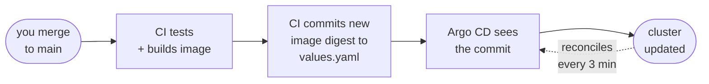

# Part 09 · GitOps with Argo CD: the final loop

One problem remains. Every deploy so far, *you* ran. That means someone needs
cluster credentials, and there is no record of who deployed what. GitOps closes
that gap.

The rule is one sentence:

!!! note "The GitOps rule"

    **Git is the only description of what should be running.** Nobody deploys.
    A program watches Git and makes the cluster match it.

Which changes the flow into a loop with no human in the deploy step:



1. You merge a change to `main`.
2. CI tests it, builds the image, and **commits the new image ID back into
   `values.yaml`**.
3. Argo CD notices that commit and updates the cluster.
4. The commit history *is* the deployment log.

Note what CI does *not* do: it never touches the cluster. It has no cluster
credentials at all. Its final act is a Git commit.

## Install Argo CD

```bash title="terminal — anywhere"
kubectl create namespace argocd
kubectl apply -n argocd -f https://raw.githubusercontent.com/argoproj/argo-cd/v3.5.1/manifests/install.yaml

kubectl wait -n argocd --for=condition=available --timeout=300s \
  deployment/argocd-server
```

## Log in

```bash title="terminal — leave running"
kubectl port-forward -n argocd svc/argocd-server 8081:443
```

In a second terminal, get the starting password:

```bash title="terminal — a second terminal"
kubectl -n argocd get secret argocd-initial-admin-secret \
  -o jsonpath='{.data.password}' | base64 -d; echo
```

Open [https://localhost:8081](https://localhost:8081), accept the certificate
warning, and log in as `admin`.

!!! warning "Change that password immediately"

    The initial password sits in the cluster in plain text. Change it in the UI
    under *User Info*, then delete the secret:

    ```bash
    kubectl -n argocd delete secret argocd-initial-admin-secret
    ```

## Register the application

Edit `gitops/argocd/02-application.yaml` and change `repoURL` to your own fork,
then:

```bash title="terminal — in the project folder"
kubectl apply -f gitops/argocd/02-application.yaml
```

Refresh the UI. You will see your app appear and sync itself into place, drawn
as a live tree of every resource it created.

## Watch self-healing work

Try to sabotage it by hand:

```bash title="terminal — anywhere"
kubectl scale deployment go-web-app --replicas=1
kubectl get pods --watch
```

Within seconds Argo CD notices reality disagrees with Git and puts the replicas
back. Your manual change is *reverted*. That is `selfHeal`, and it is a feature:
the cluster cannot drift away from what is written down.

Which also means the correct way to roll back is no longer a `kubectl`
command — it is a Git revert:

```bash title="terminal — in the project folder"
git revert <the-bad-commit>
git push
```

Argo CD sees the revert and rolls the cluster back for you. A
`kubectl rollout undo` here would simply be undone again, because Git still says
otherwise.

!!! success "Checkpoint — you are done"

    - Argo CD shows your app **Healthy** and **Synced**.
    - You scaled a deployment by hand and watched it get reverted.
    - You can describe the full loop: push → test → build → sign → commit →
      sync → live.
