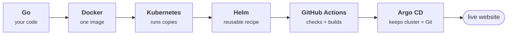

# Zero to Kubernetes

You have never written Go, built a container, or touched a cluster. By the end
of this guide you will have done all three — and shipped a website that deploys
itself.

| | |
|---|---|
| **Prior knowledge** | None. You can type commands. |
| **Time** | ~3 hours, spread over parts |
| **Cost** | Free through Part 07 |
| **Project** | `go-web-app-devops` |

## The map: what you are actually building

Before any commands, spend four minutes here. Almost everyone who gets lost
later got lost because they skipped this page and started copying commands
without knowing what they were for.

There is **one website** in this project. It is small on purpose: four pages
about learning DevOps. The website is not the point. The point is everything
that happens between "I changed a file" and "the change is live on the
internet."

That journey has six stages, and each stage is one tool:

### What each word means, in one sentence

| Word | The one-sentence version | Why this project uses it |
|---|---|---|
| **Go** | A programming language that compiles your source into one single executable file. | That single file has no dependencies, which makes every later step simpler. |
| **Docker** | Packs your program plus everything it needs into a sealed box called an *image*. | The image runs identically on your laptop and on a server. "Works on my machine" stops being a problem. |
| **Kubernetes** | Runs your images across many machines, restarts them when they die, and replaces them one at a time when you update. | It is how you get a site that stays up while you deploy to it. |
| **Helm** | A template engine for Kubernetes files, so one recipe serves dev, staging and production. | Stops you copy-pasting near-identical YAML files and letting them drift apart. |
| **GitHub Actions** | Robots that run your tests and build your image every time you push code. | Catches your mistake before a user does. |
| **Argo CD** | Watches your Git repository and makes the cluster match it. | Git becomes the single record of what is deployed. No one deploys by hand. |

!!! note "The one idea to hold on to"

    Every tool here exists to remove a human from a step where humans make
    mistakes. Go removes "did you install the right library?" Docker removes
    "it worked on my laptop." Kubernetes removes "who restarts it at 3am?"
    Argo CD removes "who ran the deploy, and what did they actually deploy?"

!!! success "Checkpoint"

    You can say out loud, without looking, what Docker does and what Kubernetes
    does — and why they are two different things. That is enough. Everything
    else you will learn by doing.

## The path

<a class="gwa-card" href="01-install-your-tools/">PART 01<strong>Install your tools</strong>Five tools, then verify every one</a>

<a class="gwa-card" href="02-run-the-website/">PART 02<strong>Run the website</strong>Three commands to your first win</a>

<a class="gwa-card" href="03-read-the-code/">PART 03<strong>Read the code</strong>The only four ideas you need</a>

<a class="gwa-card" href="04-build-a-container/">PART 04<strong>Build a container</strong>Why the image is 11MB, not 900MB</a>

<a class="gwa-card" href="05-your-first-cluster/">PART 05<strong>Your first cluster</strong>Free, local, and self-healing</a>

<a class="gwa-card" href="06-package-with-helm/">PART 06<strong>Package with Helm</strong>One recipe, many environments</a>

<a class="gwa-card" href="07-automate-with-cicd/">PART 07<strong>Automate with CI/CD</strong>Robots do it on every push</a>

<a class="gwa-card" href="08-deploy-to-the-cloud/">PART 08<strong>Deploy to the cloud</strong>Real AWS — costs real money</a>

<a class="gwa-card" href="09-gitops-with-argocd/">PART 09<strong>GitOps with Argo CD</strong>Closing the loop</a>

<a class="gwa-card" href="10-when-it-breaks/">PART 10<strong>When it breaks</strong>Every error you will hit</a>

Stuck on a word? The [glossary](glossary.md) has all 28 of them.
